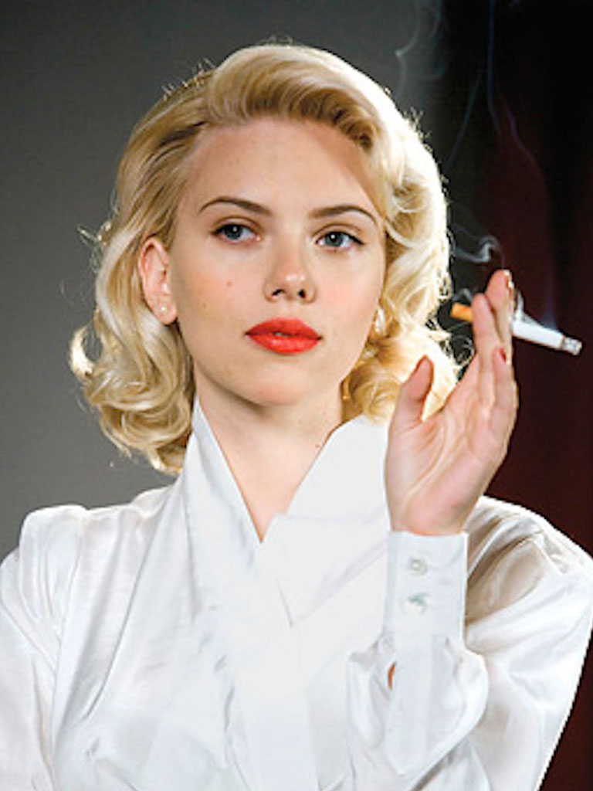
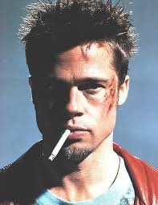
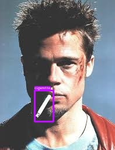
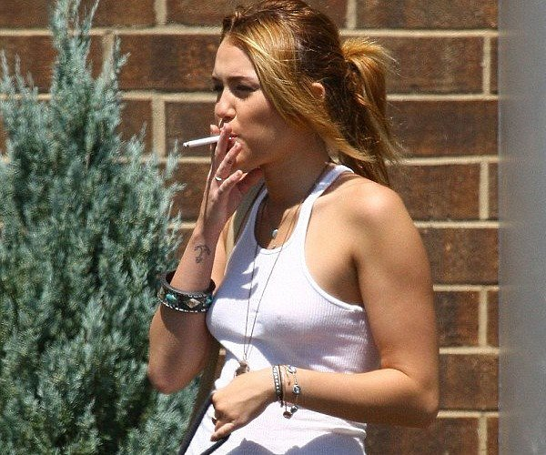
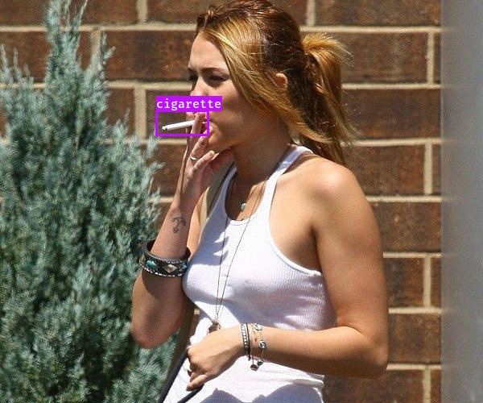
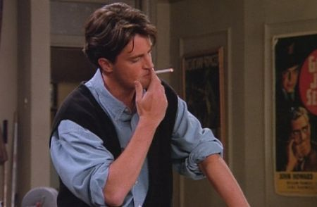
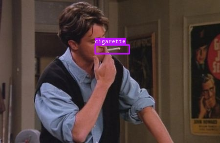
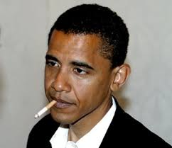
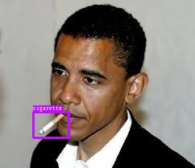
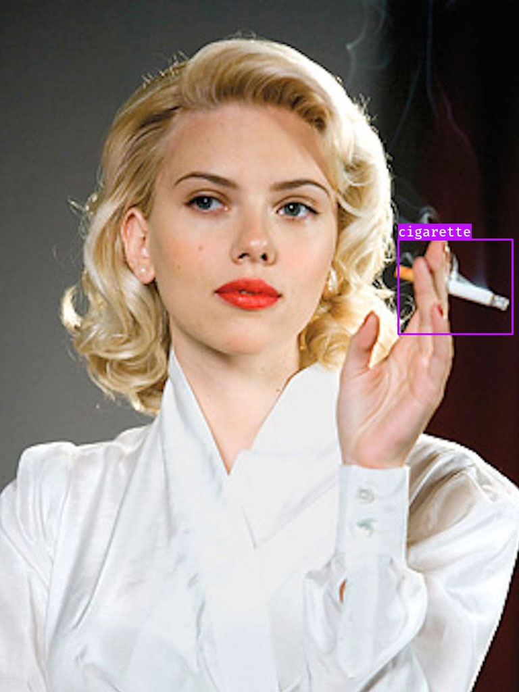

# CigaRecognition


This project aims to build an object identification algorithm, based on YOLOv3 in DarkNet framework, which is able to identify cigarettes and cigars.

## Why would this be relevant?
The number of smokers have been falling in the whole world, due to the fact the people tend to take more care about their health. Moreover, in some countries there are laws which forbid cigarettes and cigars in some environments. This would be the case for stadiums and bars in Brazil.
Therefore, this identification could help the authorities in charge to identify subjects who are not respecting the law and then follow the corresponding legal procedures.

## Dataset
The dataset consisted of 300 images of people smoking, which I collected on my own by searching for it in the internet.
The traininig set consisted of 255 images randomly selected from teh dataset, whereas the test set contained 45 images. That is, the test size ratio is equal to 15%.
We can observe below an example of an image, which we are going to use in order to test our model. Therefore, this image presenting our *beloved Scarlett Johansson* was not used to train or even evaluate the model during the training phase.



## Labeling Dataset in YOLOv3 Format
Before training our model to custom dataset, it is necessary to annotate our images. That is, we need to specify where there are **bounding boxes** within the image and to which class each one belongs.
For this purpose, I have used **LabelImg** tool, since it is easy to use, free and supports YOLOv3 output format.
If you want to run it, you can use the code below:
```sh
$ pip3 install labelImg
$ labelImg
```
Therefore, I could draw the bounding boxes in each one of the 300 images. As a result, for each image file, we have an associated *.txt* file with the description of the bounding boxes.
```sh
-./labelled-images/
---001.jpg
---001.txt
```
In this text file, there are 5 columns, which one responsible for one information:
```sh
[class_index] [x_center] [y_center] [width] [height]
```
**001.txt**
```sh
0 0.615000 0.529081 0.212500 0.097561
```
The class index is related to the line of each label in a file called **classes.names**. For instance, in this problem our file consists of just one line with the label *cigarette*.

**classes.names**
```sh
cigarette
```

Another important step is to save two files - **train.txt** and **validation.txt**, where the full path to each image is located, line by line.

**train.txt**
```ssh
/mydrive/customYOLOv3/labelled-images/183.jpg
/mydrive/customYOLOv3/labelled-images/231.jpg
(...)
```

Once all these files are ready, we have to prepare our most important file, which is **labelled-data.data**. In this file, we indicate the number of classes and the full path to **classes.names**, **train.txt** and **validation.txt** files, as well as the folder where we wanto to save YOLOv3 weights during training.

Therefore:

**labelled-data.data**
```ssh
classes = 1
train = data/train.txt
valid = data/validation.txt
names = data/classes.names
backup = /mydrive/customYOLOv3/backup
```

##### How was it done?
In the scope of this project, all that is necessary to do is to follow the steps below:

1. Save dataset in *labelled-images* folder.
2. Open **LabelImg** and draw the bounding boxes on each image with the corresponding labels.
3. Execute following command on terminal:
```sh
$ ./prepare_yolo_trainig.sh
```
This bash script calls all python scripts necessary to do the hard job.

## DarkNet FrameWork
I have used DarkNet Framework in order to train my custom YOLOv3, hence I acknowledge here their awesome and impressive work. Thanks, Joseph and Ali!
The next step is go to **GoogleColab** to train our model, since we need GPU for this task. So, the first thing to do is to generate a *zip* file of this folder and then send it to the main folder on Google Drive. Once we do it, we can initiate our procedure in GoogleColab, according to the following steps.

##### Training YOLOv3 in GoogleColab

1. When we begin a new session, we need to make sure that our current run session type is set to **Python3** and **GPU**.
2. We need then to make it possible to access our files stored in Google Drive.
```python
from google.colab import drive
drive.mount('/content/gdrive', force_remount=True)
```
A link will appear in the screen, so you need to follow it, in order to get the authorization key.
3. We can create a symbolic link so that now the path */content/gdrive/My Drive/* is equal to */mydrive*
```python
!ln -s /content/gdrive/My\ Drive/ /mydrive
```
4. Then we need to unzip the zip file
```python
%%capture
!unzip /mydrive/customYOLOv3.zip -d /mydrive/
```
5. So it is time for us to build darknet and make some adjusts, especially in the *MakeFile*, where we enable GPU and CV2. Please note that we are importing darknet from the GitHub.
```python
%%capture
# clone darknet repo
!git clone https://github.com/AlexeyAB/darknet
%cd darknet
!sed -i 's/OPENCV=0/OPENCV=1/' Makefile
!sed -i 's/GPU=0/GPU=1/' Makefile
!sed -i 's/CUDNN=0/CUDNN=1/' Makefile
!make
```
6. In the context of this application, we will use **Transfer learning** approach. Therefore, we need to download a file containing pre-trained weights, so we can use them when we start the training process.
```python
!wget http://pjreddie.com/media/files/darknet53.conv.74
```
7. We need to save data in the proper location as well as edit the configuration files properly in order to go to the training step.
```python
!cp /mydrive/customYOLOv3/classes.names ./data
!cp /mydrive/customYOLOv3/train.txt ./data
!cp /mydrive/customYOLOv3/validation.txt ./data
```
8. **YOLO cfg** file needs to be downloaded and the text of the three output layers is edited according to the number of classes in the problem. Moreover, the batch size as well as the number of iterations are adjusted. We write **two files**: one for the training phase and other for testing the model later. Both files can be found in the **backup** folder - **yolov3_train.cfg** and **yolov3_test.cfg**.

**General Configuration:**
> max_batches = 4000
steps = 3200, 3600

**[TRAINING]**
> batch = 64
subdivisions = 64

**[TEST]**
 > batch = 1
subdivisions = 1

**3 Last CONV+YOLO layers**:
> classes = 1
filters = 3(n+5) = 3(1+5) = 18

Once these changes are made, we can upload both files to *darknet/cfg*.
9. So it is time to finally train our model.
```python
!./darknet detector train data/labelled_data.data cfg/yolov3_train.cfg darknet53.conv.74 -dont_show
```
After a few hours, our model is finally trained and we can evaluate it.

10. We can look at **mAP (mean average precision)** in order to evaluate the performance of our model. This metric is the average of AP, which consists of the area under Precision-Recall curve. In some context, we compute the AP for each class and average them. But in this project, they mean the same thing, since we have only one class. So, the following code allows us to obtain mAP:
```python
!./darknet detector map data/labelled_data.data cfg/yolov3_train.cfg /mydrive/customYOLOv3/backup/yolov3_train_final.weights
```
Here we have obtained: **mAP@0.50 = 0.585549, or 58.55 %**
That is, considering a IoU - Intersection over Union - of 50% in order to consider the object as detected, we have reached 58.55%. That is a satisfactory result, when we take into account the fact that only 300 images were used in the process. Therefore, gathering more images could bring us to a better performance. Another approach that can be used is to use a lower thershold than 50% when predicting on new images.

11. Finally, we can test the model on our image of Scarlett Johansson and see if we are able to detect the cigarette. Here we use a threshold of 30%.
```python
!./darknet detector test data/labelled_data.data cfg/yolov3_test.cfg /mydrive/customYOLOv3/backup/yolov3_train_last.weights /mydrive/customYOLOv3/test/cigarette.jpg -thresh 0.3
```


This procedure can be completely seen in the file **CigaRecognition.ypinb**.

## Applying Model to Tests and Videos

In order to be able to apply our developed model to more images and even to videos, I have made two files available:

+ object_detection_image.py
+ object_detection_video.py

So we can try capturing the bounding boxes, as we can see below:

+ Brad Pitt

 BEFORE:
 


AFTER:



+ Miley Cyrus

 BEFORE:
 


AFTER:



+ Chandler Bing

 BEFORE:
 


AFTER:



+ Obama

 BEFORE:
 


AFTER:



+ Scarlett Johansson

 BEFORE:
 


AFTER:




**Gabriel Fernandes Luz**
<gfluz94@gmail.com>
